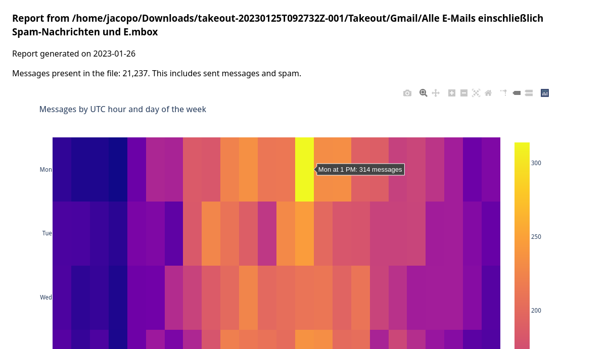

# Mbox mail analysis

This is a script that analyzes an mbox mail export, such as the one provided by Google Takeout from a Gmail box, and produces a report on the content.

## Reports

* received mails over hour of the day and day of the week
* mail per day over time
* most active addresses

## Usage

You need an export of your mailbox in mbox format (for Gmail you can get it from [Google Takeout](https://takeout.google.com/)).

Then, run `make setup-venv` to create a local environment in the `.venv` folder, and `.venv/bin/mbox-analyze all_messages.mbox` where `all_messages.mbox` is your mbox file. It will generate an HTML report and open your default browser.

### Uninstall

Delete the whole cloned folder, the above virtualenv is created in `.venv` inside it

